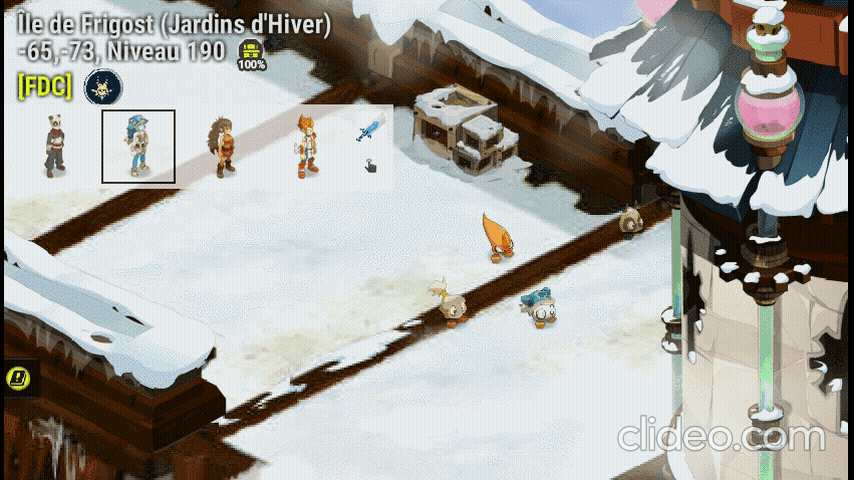
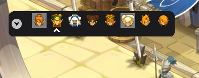
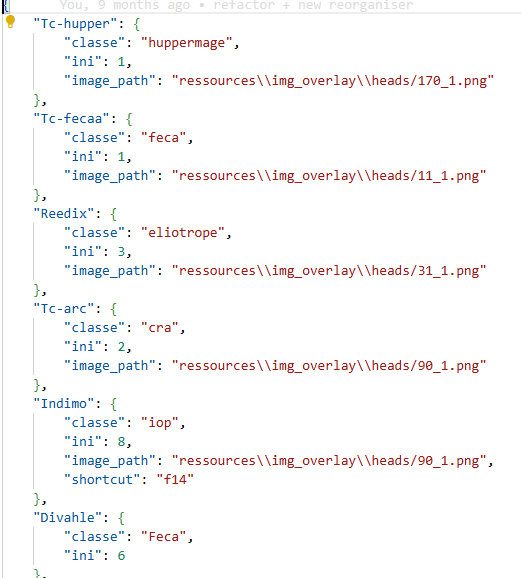
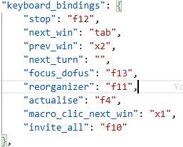
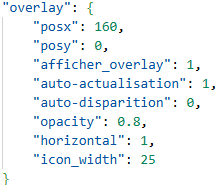

# Dofus Overlay - Dofus Tools

## Aide à la gestion du multi-comptes sur dofus

Passer d’un personnage à l’autre en plein combat ne devrait pas ressembler à un mini-jeu de gestion de fenêtres. Cet outil a justement été pensé pour simplifier les sessions multi-compte sur Dofus et rendre la navigation entre les comptes plus rapide, plus fluide et surtout moins pénible au quotidien.

Une version prête à l’emploi sera proposée prochainement pour les utilisateurs qui ne souhaitent pas mettre les mains dans Python, tout en laissant également l’accès aux sources pour ceux qui aiment comprendre ce qu’ils installent.

Même si l’objectif est simplement d’améliorer le confort de jeu, il reste important de rappeler qu’utiliser un programme externe demande toujours un minimum de vigilance. Vérifier les fichiers, consulter le code et télécharger uniquement depuis la source officielle reste la meilleure manière d’éviter les mauvaises surprises.

Le projet reprend l’idée générale de certains outils déjà connus de la communauté, notamment l’Organizer de DofusGuide, tout en apportant plusieurs ajustements, corrections et petits ajouts personnels. Si vous préférez utiliser une solution déjà bien installée dans l’écosystème Dofus plutôt qu’un projet partagé par un développeur random sur GitHub, leur application reste évidemment une alternative très correcte

## Installation:

- Téléchargez dofusOverlay.zip de la dernière release
- Dézipez le dossier
- Exécutez dofusOverlay.exe (il est possible que le logiciel ne soit pas reconnu par windows et que cela demande une autorisation)

## Fonctionnalités:

#### L’objectif du projet est de proposer un overlay pratique pour le multi-compte tout en restant dans une utilisation raisonnable et respectueuse des règles du jeu. À l’heure actuelle, les fonctionnalités intégrées ont été pensées pour améliorer le confort d’utilisation sans automatiser le gameplay. [Lien forum dofus](https://www.dofus.com/fr/forum/1069-dofus/2404061-macros-autorise?page=2#entry13291455)

- Passage rapide d’une fenêtre Dofus à l’autre avec TAB et retour arrière avec SHIFT + TAB.
- Raccourcis entièrement modifiables depuis le fichier de configuration ou directement via l’interface pendant l’exécution.
- Disparition automatique de l’overlay lorsque la fenêtre Dofus n’est plus active, pour éviter d’avoir un HUD géant perdu sur le bureau.
- Changement de personnage en cliquant simplement sur son portrait dans l’overlay.
- Déplacement libre de l’interface par glisser-déposer.
- Macro optionnelle permettant d’enchaîner clic + changement de fenêtre pour gagner en fluidité.
- Possibilité d’exclure certains personnages de la rotation avec CTRL + clic, pratique quand un perso sert juste de mule ou dort au zaap.
- Réorganisation rapide des fenêtres via une touche dédiée.
- Retour instantané sur la dernière fenêtre active.
- Rafraîchissement manuel pour éviter certains comportements indésirables ou boucles de détection.
- Affichage horizontal ou vertical selon les préférences et l’espace disponible à l’écran.
- Sauvegarde automatique des positions, de l’ordre des personnages et des images utilisées.
- Une fonctionnalité d’invitation automatique des personnages dont la fenêtre est ouverte existe également, mais son utilisation peut être discutable vis-à-vis des règles du jeu. Elle est donc présente principalement à titre expérimental et il est recommandé de rester prudent avec ce type d’option.

#### Nouveau visuel, sur le modèle de dofus guide

## Configurations:

Dans le fichier ressources/config.json, il est possible de faire quelques modifications pour personnaliser l'overlay

- il est possible de changer l'image associée à chaque personnage.
  Pour cela il faut cliquer sur la flèche lors de l'exécution puis sur le visage pour sélectionner une nouvelle icon ou ajouter une image dans ressource puis configurer le path dans information.json

- il est possible de changer l'assignation des touches pour certaines options

- quelques autres modification comme la position de l'overlay et son opacité /!\ pas encore géré pour le nouvel overlay

## Bugs

-

## A ajouter:

-

## Bugs résolus

-

## Feature ajoutée

- Macro click + tab

Toutes images de personnage de [Dofus](https://www.dofus.com/fr/prehome) sont la propriété d'[Ankama](https://www.ankama.com/fr)
